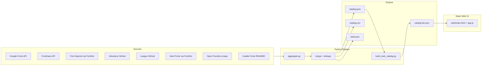

# System Patterns

## Architecture



## Key patterns

### Source adapters
Each source has a module in `scripts/sources/` with:
- `fetch_raw()` — downloads to `data/raw/<source>.json`
- `to_catalog_entries()` — normalizes to unified font family schema

### Merge priority
When deduplicating by family name slug, source priority:
1. google-fonts
2. fontshare
3. velvetyne
4. league-of-moveable-type
5. open-foundry
6. font-squirrel
7. nerd-fonts

Higher-priority source wins; metadata merged (tags, featured_lists).

### Featured tagging
`usable_fonts.py` provides slug → featured list map cross-referenced during merge.

### License filtering
Default: `commercial_use=True` only. Flagged via `is_commercial_ok()` in utils.

### Web UI loading
- Lazy infinite scroll (48 cards per batch)
- IntersectionObserver for font preview loading
- Google Fonts → CSS API; Fontshare → direct woff2 @font-face

## File layout
```
free-font-site/
├── scripts/aggregate.py      # orchestrator
├── scripts/sources/*.py        # per-source adapters
├── scripts/build_web_catalog.py
├── data/output/              # full catalog (committed)
├── data/raw/                 # cached fetches (gitignored)
├── web/                        # static UI
├── schema/font.schema.json
└── health.html                 # port-forward test page
```

## Cursor cloud setup
`.cursor/environment.json` auto-starts server on port 8080 in tmux.
