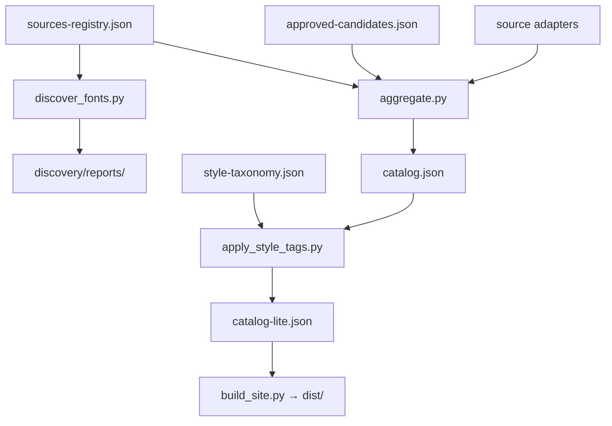

# Continuing Font Discovery Operation

This document defines how we **continuously** find free fonts that we can **legally offer** on Free Font Catalog, classify them for users (Old English, Y2K, web-modern, pixel, etc.), and merge them into the site.

## Goals

1. **Grow the catalog** with verified libre / commercial-safe fonts only.
2. **Surface “cool” styles** — Old English/blackletter, pixel/retro, Y2K/web 2.0, experimental/web 3.0, display, script, mono.
3. **Stay defensible** — license + source URL on every family; no “personal use only” fonts.
4. **Automate diffing** — weekly reports of *new* fonts per source vs our catalog.
5. **Human gate** for unclear sources (Free Faces, UNCUT, FontSpace, etc.).

## Legal bar (non-negotiable)

A font is **offerable** on the site only if:

| Check | Requirement |
|-------|----------------|
| License | OFL, Apache-2.0, UFL, MIT, BSD, CC0, GPL (+ font exception), or ITF FFL / equivalent **commercial OK** |
| `commercial_use` | Must be `true` in our catalog |
| Attribution | `license_url` + link to original source |
| Re-hosting | We **catalog + link**; we do not bundle binaries unless license explicitly allows |

**Reject** if license text contains: personal use only, demo, trial, not for commercial redistribution.

## Architecture



## Weekly operating procedure

### 1. Run discovery (every Monday or before release)

```bash
cd free-font-site
python3 scripts/discover_fonts.py
```

Read the latest report in `discovery/reports/`:

- **`new_from_sources`** — families seen on a source but not in catalog (candidates to research).
- **`source_counts`** — health check per adapter.
- **`style_coverage`** — counts per style tag (gaps to fill).

### 2. Research new candidates

For each interesting family:

1. Open official source page (foundry / GitHub / Google specimen).
2. Read license (OFL file, README, or site footer).
3. If commercial-safe → add to `discovery/approved-candidates.json` **or** fix/extend source adapter.
4. If source is bulk-trusted (Google, Fontshare, Fontsource non-Google, Omnibus) → usually already auto-merged; discovery report is informational.

### 3. Apply style tags

```bash
python3 scripts/apply_style_tags.py
```

Tags power UI filters: Old English, pixel-retro, y2k-web, web-modern, etc.  
Edit rules in `discovery/style-taxonomy.json` when adding new aesthetic buckets.

### 4. Rebuild site

```bash
python3 scripts/build_all.py
python3 scripts/serve.py 8080
```

Verify previews + specimen pages for a sample of new fonts.

### 5. Log decisions

Update `memory-bank/progress.md` with:

- Date, source, families added, any license notes.

## Source tiers

| Tier | Meaning | Examples |
|------|---------|----------|
| **verified-libre** | Auto-merge via adapter | Google Fonts, Fontsource (non-Google) |
| **verified-commercial-free** | Auto-merge | Fontshare |
| **verified-ofl** | Auto-merge | Omnibus, Velvetyne, League |
| **reviewed-commercial-free** | Auto-merge with filter | Font Squirrel (FontGet mirror) |
| **manual-review** | Report only until human approves | Free Faces, UNCUT (planned) |
| **human-verified** | `approved-candidates.json` | One-off finds |

Registry: `discovery/sources-registry.json`

## Style taxonomy (user-facing)

| Tag | User intent |
|-----|-------------|
| `old-english` | Blackletter, Fraktur, medieval |
| `pixel-retro` | 8-bit, pixel fonts |
| `y2k-web` | Web 2.0 / techno / futuristic display |
| `web-modern` | Contemporary UI / brand sans |
| `experimental` | Velvetyne-style contemporary |
| `handwritten-script` | Script & handwriting |
| `monospace-dev` | Coding fonts |
| `brand-display` | Poster/display from Fontshare etc. |

Config: `discovery/style-taxonomy.json`

## Adding fonts manually (approved candidates)

Edit `discovery/approved-candidates.json`:

```json
{
  "family_name": "Example Font",
  "license_type": "OFL",
  "license_url": "https://openfontlicense.org",
  "commercial_use": true,
  "source_url": "https://…",
  "download_url": "https://…",
  "category": "display",
  "style_tags": ["old-english"],
  "verified_at": "2026-07-27",
  "verified_by": "your-name",
  "notes": "License checked on foundry site"
}
```

Then run `build_all.py`. Duplicates merge by family name slug.

## CI / automation

GitHub Actions:

- **`deploy-pages.yml`** — weekly full rebuild + deploy.
- **`discover-fonts.yml`** — weekly discovery report (artifact upload; optional PR comment in future).

## Backlog (next sources to implement)

1. **UNCUT.wtf** — headless scrape or official feed.
2. **Free Faces** — improve scraper; until then manual candidates.
3. **Collletttivo** — locate GitHub org / releases.
4. **FontSpace** — only with automated license field parse + quarantine table.
5. **Google Fonts `tags` metadata** — map stroke/tag fields into style_tags automatically.

## Success metrics

- Catalog family count trend ↑
- % families with `preview_woff2` ↑
- Style tag coverage (each tag ≥ N families)
- Zero legal complaints / DMCA (maintain attribution pages)

## Contacts & repo

- Catalog repo: `actiondigitalmedia/font-sitte`
- DMCA: add contact in `privacy.html` before public launch
